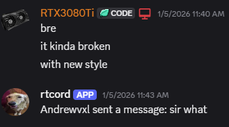

# Messaging Bot
:::note

The bot shown in this page was developed using BotGhost. We are actively working on a fresh new and open-source bot.

:::

This bot is only available on the **RtCord official server**.

## Messages logs
If you follow this tutorial in order you probably have already set up the webhook. If not, check the steps [here](/status-messages).

## Sending messages from Discord
What the bot did was listening to **all messages** on a specific Discord channel, as seen in the image below:

